# Informe de Avance del Proyecto Final
## Sistema de Alquileres para Estudiantes Universitarios de Sucre sobre Infraestructura Cloud AWS

**Universidad San Francisco Xavier de Chuquisaca**
**Asignatura:** Trabajando en la Nube (COM610)
**Docente:** Ing. Marcelo Quispe Ortega
**Semestre:** 1/2026
**Fecha de entrega:** 27 de mayo de 2026

---

**Repositorio GitHub:** https://github.com/noegonzalespereira/plataforma_alquileres_estudiantil

---

## Datos del Estudiante


#### Estudiante: Noemi Noelia Gonzales Pereira
#### Carrera: Ingeniería de Sistemas

---

## 1. Descripción del Proyecto


### 1.1 Descripción General

El proyecto consiste en una plataforma web que centraliza la oferta y demanda de alojamientos universitarios en la ciudad de Sucre. La aplicación cuenta con tres roles principales:

**Estudiante:** Puede visualizar los ambientes disponibles en alquiler, filtrar por tipo de inmueble, precio y servicios. Puede ver detalles completos de cada inmueble con sus fotos y chatear en tiempo real con los propietarios para solicitar más información.

**Propietario:** Publica sus inmuebles (cuartos, monoambientes, alojamientos) con fotografías, precio, descripción y servicios incluidos (agua, luz, internet, etc.). Gestiona sus chats con estudiantes, administra sus inmuebles rentados, contratos y visualiza las opiniones publicadas. Al publicar un inmueble debe pagar un monto según los días de visibilidad deseados y subir el comprobante de pago.

**Administrador:** Gestiona todos los inmuebles, valida los comprobantes de pago enviados por los propietarios para aprobar la visibilidad de las publicaciones, gestiona usuarios, servicios y contratos.

### 1.2 Stack Tecnológico

| Capa | Tecnología |
|------|-----------|
| Backend | NestJS (Node.js + TypeScript) |
| Frontend | React + Vite |
| Base de datos | PostgreSQL (Amazon RDS) |
| Almacenamiento | Amazon S3 + CloudFront |
| Servidor web | Nginx (proxy inverso) |
| Contenedores | Docker + Docker Compose |
| CI/CD | GitHub Actions + Docker Hub |
| Infraestructura | Amazon EC2, RDS, S3, ALB, ASG |
| Chat en tiempo real | WebSockets (NestJS) |
| Procesamiento de imágenes | AWS Lambda (Node.js + Sharp) |
| Notificaciones por correo | Amazon SES (Simple Email Service) |

---

## 2. Tabla de Infraestructura / Servicios

| Componente | Rol | Tecnología | IP / Endpoint / Puerto | Estado |
|-----------|-----|-----------|----------------------|--------|
| EC2 `ec2-alquileres` | Servidor de aplicación | Ubuntu 24.04 + Docker | `52.4.135.83` | Operativo |
| Contenedor `alquileres-api` | API REST + WebSockets | NestJS | `52.4.135.83:3001` | Operativo |
| Contenedor `alquileres-frontend` | Frontend React | Nginx | `52.4.135.83:8080` | Operativo |
| RDS `db-alquileres` | Base de datos gestionada | PostgreSQL 18 | `db-alquileres.cmdk6w2y4l62.us-east-1.rds.amazonaws.com:5432` | Operativo |
| S3 `alquileres-imagenes-10380909` | Almacenamiento de imágenes | Amazon S3 | Bucket privado | Operativo |
| CloudFront `cdn-alquileres` | CDN para imágenes | Amazon CloudFront | `https://d3nc8ux154p82r.cloudfront.net` | Operativo |
| ALB `alb-alquileres` | Balanceador de carga | Application Load Balancer | DNS del ALB | Operativo |
| ASG `asg-alquileres` | Escalado automático | Auto Scaling Group | Min:1 / Deseado:1 / Max:4 | Operativo |
| IAM `alquileres-s3-user` | Control de acceso S3 | AWS IAM | Política `policy-alquileres-s3` | Operativo |
| GitHub Actions | Pipeline CI/CD | GitHub Actions + Docker Hub | Rama `main` | Operativo |
| Red Docker `red-alquileres` | Red interna | Docker Network | Interna | Operativo |
| Volumen `vol-uploads` | Persistencia de archivos | Docker Volume | `/app/uploads` | Operativo |
| Lambda `lambda-redimensionar-img` | Redimensionamiento automático de imágenes | AWS Lambda (Node.js + Sharp) | Trigger: evento S3 `ObjectCreated` | Operativo |
| SES `alquileres-notificaciones` | Envío de correos de notificación | Amazon SES | Región `us-east-1` | Operativo |

---

## 3. Diagrama de Arquitectura
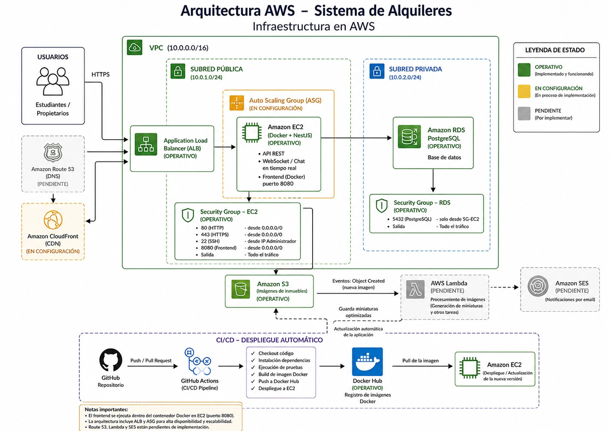


## 4. Bitácora de Avance

| # | Fecha | Actividad | Responsable | Dificultad superada |
|---|-------|-----------|------------|---------------------|
| 1 | 25/05/2026 | Mejoras y corrección de bugs del software antes de la dockerización: se corrigieron errores en los módulos de contratos, inmuebles y autenticación, se mejoró la validación de DTOs, se ajustó el flujo de aprobación de publicaciones por el administrador y se verificó el funcionamiento completo de los 3 roles (estudiante, propietario, administrador) en entorno local con PostgreSQL en localhost | Noemi Noelia Gonzales Pereira | Se identificaron inconsistencias en los guards de roles y en el manejo de tipos `any` en TypeScript. Se corrigieron los controladores afectados y se verificó que todos los endpoints respondieran correctamente antes de proceder con la dockerización. |
| 2 | 26/05/2026 | Dockerización completa del proyecto: creación del `Dockerfile` multi-stage para la API NestJS (etapa builder + etapa runtime ligera ~150MB), `Dockerfile` para el frontend React con Nginx, `docker-compose.yml` con red interna `red-alquileres`, volúmenes `vol-db-datos` y `vol-uploads`, healthcheck en PostgreSQL, y `.dockerignore` para excluir `node_modules` y `.env` | Noemi Noelia Gonzales Pereira | La imagen de PostgreSQL rechazaba contraseñas vacías — se resolvió configurando `DB_PASSWORD` con valor no vacío. El `DB_HOST` debía apuntar al nombre del servicio `db` en lugar de `localhost`. El t3.micro se quedaba sin RAM durante el build (`signal: killed`) — se resolvió agregando 2GB de swap con `sudo fallocate -l 2G /swapfile && sudo mkswap /swapfile && sudo swapon /swapfile`. |
| 3 | 26/05/2026 | Creación de infraestructura AWS completa: RDS PostgreSQL (`db-alquileres`, SSL obligatorio), bucket S3 con política IAM de mínimo privilegio (`policy-alquileres-s3`), usuario IAM `alquileres-s3-user`, instancia EC2 Ubuntu 24.04 con IP elástica `52.4.135.83`, Security Groups, CloudFront CDN (`d3nc8ux154p82r.cloudfront.net`), creación de base de datos `alquileres_sucre_db` via psql desde EC2, despliegue inicial de contenedores en EC2 | Noemi Noelia Gonzales Pereira | El RDS exigía SSL obligatorio — se resolvió agregando `ssl: { rejectUnauthorized: false }` en TypeORM y la variable `DB_SSL=true` en el `.env`. La IP de Windows es dinámica y cambia al reiniciar, bloqueando el SSH — se aprendió a actualizar el Security Group con "Mi IP" cada vez.  |
| 4 | 26/05/2026 | Configuración del ALB (`alb-alquileres`), creación de Security Groups aislados (`alb-securitygroup` y `ec2-web-securitygroup`), creación de AMI `ami-alquileres` desde la instancia EC2 configurada, plantilla de lanzamiento `plantilla-alquileres`, Auto Scaling Group `asg-alquileres` (mín:1, deseado:1, máx:4) con política de escalado dinámico por CPU al 50% | Noemi Noelia Gonzales Pereira | En "Configuración completa" del RDS el tipo de instancia aparecía bloqueado — se resolvió seleccionando primero "Capa gratuita" en la sección Plantillas. El grupo de destino del ALB debía apuntar al puerto 8080 (frontend) con health check en `/health` para que el ALB detecte instancias sanas. |
| 5 | 27/05/2026 | Implementación del pipeline CI/CD completo con GitHub Actions (3 jobs: `build-and-test` con linting + pruebas Jest + cobertura, `build-and-push` con Docker Hub + escaneo de vulnerabilidades Trivy, `deploy` con SSH al EC2 + rollback automático si falla el health check). Corrección del endpoint `/health` (`AppController` no estaba registrado en `AppModule`). Verificación final: app funcionando en `http://52.4.135.83:8080`, imágenes en S3 servidas desde CloudFront, pipeline en verde | Noemi Noelia Gonzales Pereira | El job `deploy` fallaba con `i/o timeout` porque el Security Group bloqueaba el puerto 22 desde las IPs de GitHub Actions — se abrió SSH temporalmente a `0.0.0.0/0`. El health check retornaba 404 porque los cambios de SSL y `AppController` se hicieron en el EC2 pero no en el repo local — se sincronizaron y se hizo push para que el CI/CD construyera la imagen correcta. |


## 5. Implementación del proyecto a la infraestructura AWS


### 5.1 Dockerización del software

#### Se creo los dockerfile y dockercompose.yml en el proyecto para dockerizarlo

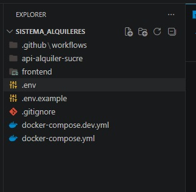
#### Listado de docker de manera local
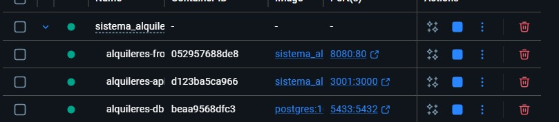.


#### Una vez que se tuvo dockerizado toda al app de manera local sin todavia tener creado los servicios de aws, se prosiguio con la creacion de los servicios para conectarlo a la app

### Creacion del bucket s3
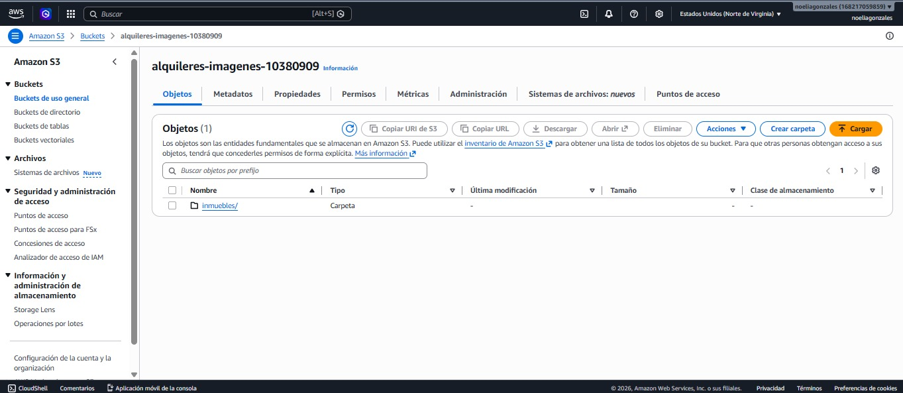
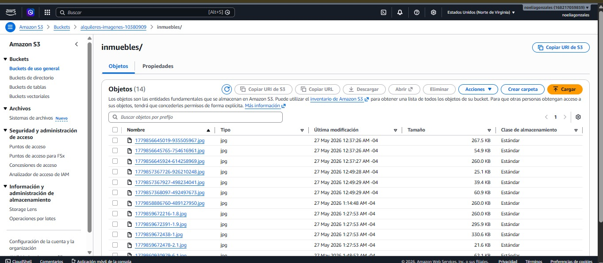

### Creacion del usuario IAM

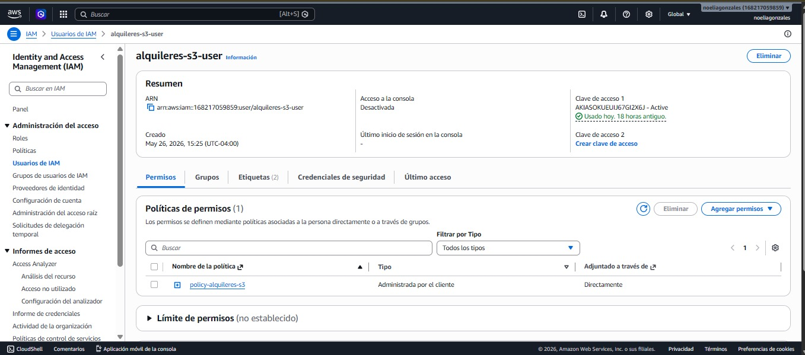

#### Se creo una politica para el usuario alquileres-s3-user, en lugar de usar la politica por defecto `AmazonS3FullAccess`, se creó una política personalizada `policy-alquileres-s3` que solo permite, que el usuario solo pueda operar sobre ese bucket específico.
#### Es decir solo puede, subir, eliminar, editar archivos en ese especifico bucket


### Creacion de los grupos de seguridad  alquileres-sg

#### Solo tendra acceso a: 
| Security Group | Puerto | Origen | Justificación |
|---------------|--------|--------|--------------|
| `alquileres-sg` | 22 SSH | 0.0.0.0/0 (temporal para CI/CD) | Acceso administrativo |
| `alquileres-sg` | 80 HTTP | 0.0.0.0/0 | Acceso web público |
| `alquileres-sg` | 443 HTTPS | 0.0.0.0/0 | Acceso web seguro |
| `alquileres-sg` | 3001 | 0.0.0.0/0 | API NestJS |
| `alquileres-sg` | 8080 | 0.0.0.0/0 | Frontend React |
| `default` (RDS) | 5432 | `alquileres-sg` | Solo el EC2 puede conectarse a la BD |
| `alb-securitygroup` | 80, 443 | 0.0.0.0/0 | Tráfico al balanceador |
| `ec2-web-securitygroup` | 80 | `alb-securitygroup` | EC2 solo recibe del ALB |

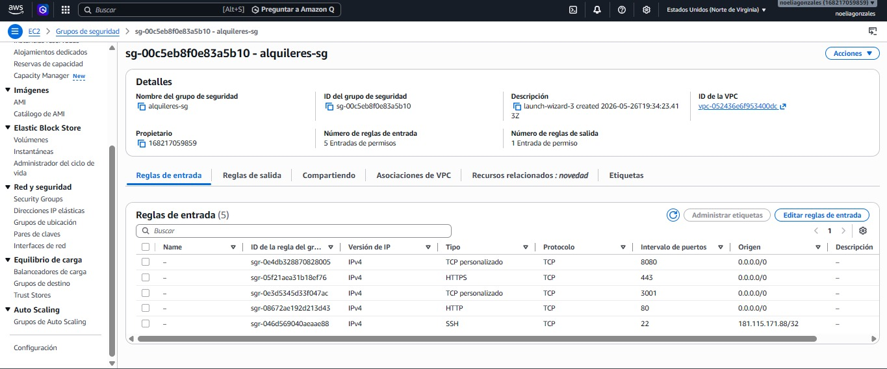


### Creacion del cdn-alquileres
#### El bucket S3 tiene **acceso público bloqueado** — nadie puede acceder directamente.
- Se configuró CloudFront con **Origin Access Control (OAC)** — solo CloudFront puede leer los archivos del bucket.
- Las imágenes se sirven exclusivamente a través de `https://d3nc8ux154p82r.cloudfront.net`.

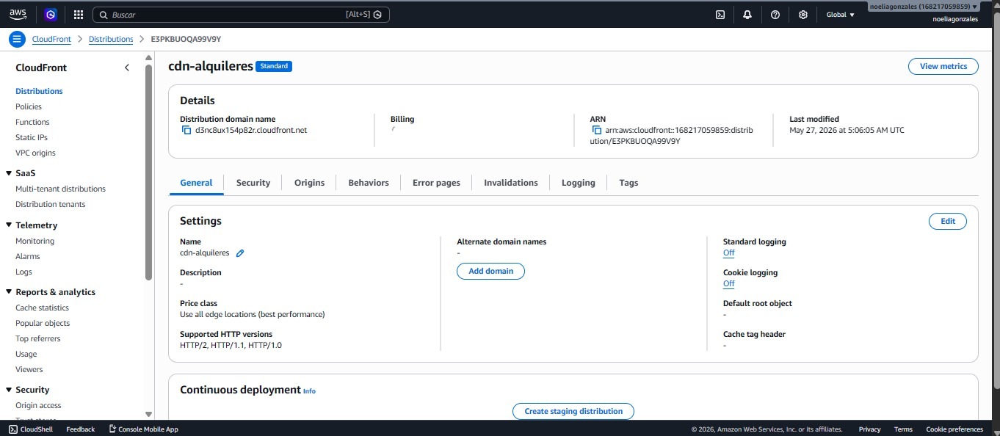

### Creacion del rds: db_alquileres
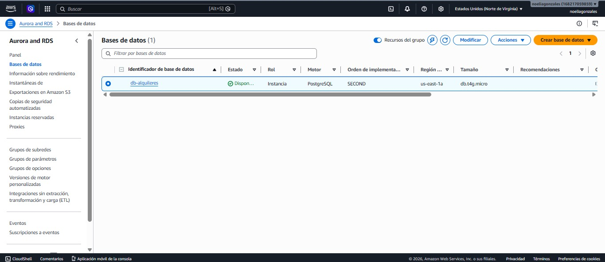

### Creacion de la instancia EC2 
#### ec2-alquileres

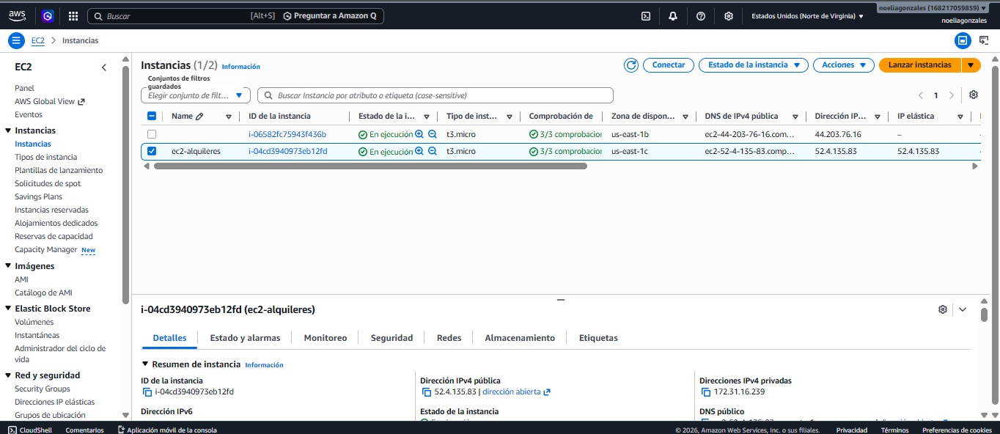

#### Para el manejo de la ip, se implemnto un ip elastica para que no vaya cambiando por si se apagara la instancia y sea una ip fija.
#### Se puso la ip publica fija : 52.4.135.83 

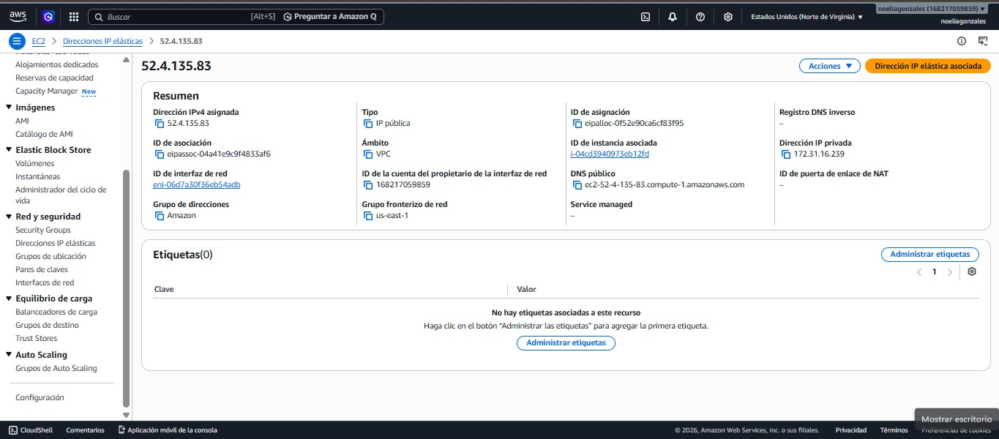


### Crear AMI desde la instancia EC2:

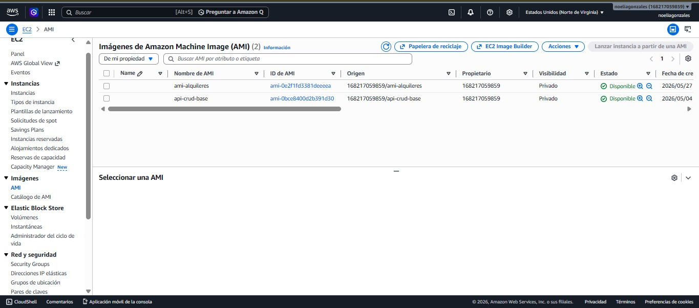


#### Se creo grupos de seguridad para el balanceador
Grupo 1 — alb-securitygroup:
  - Regla entrada: HTTP 80  → 0.0.0.0/0
  - Regla entrada: HTTPS 443 → 0.0.0.0/0

Grupo 2 — ec2-web-securitygroup:
  - Regla entrada: HTTP 80 → origen: alb-securitygroup
  (solo recibe tráfico desde el ALB, no directamente de internet)


### Se prosiguio a la creacion del balanceador de carga 

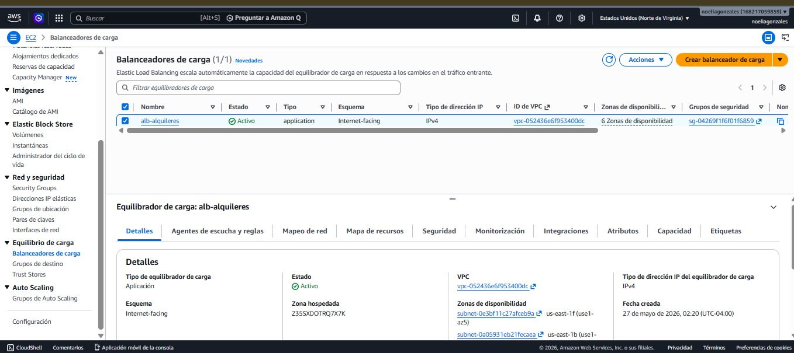


### Creacion de la plantilla de lanzamiento a partir del AMI
- Nombre: plantilla-alquileres
- Security Groups: ec2-web-securitygroup + alquileres-sg

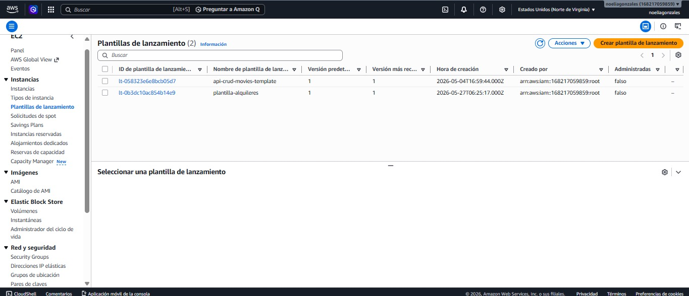


### Grupo de Auto Scaling
#### Se uso la plantilla de lanzamiento *plantilla-alquileres*, el balanceador de carga *alb-target-group*, con un tamaño de:


  - Capacidad deseada: 1
  - Mínima: 1
  - Máxima: 4

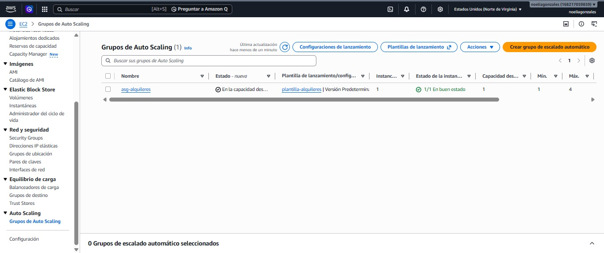

#### Dicho asg con su respectivo escaldo automatico configurado 
- Tipo: Seguimiento del objetivo (Target Tracking)
- Métrica: Utilización promedio de la CPU
- Valor de destino: 50%
 


## 6. Conexion del software a los servico de aws
### Conexion a la instancia desde la consola
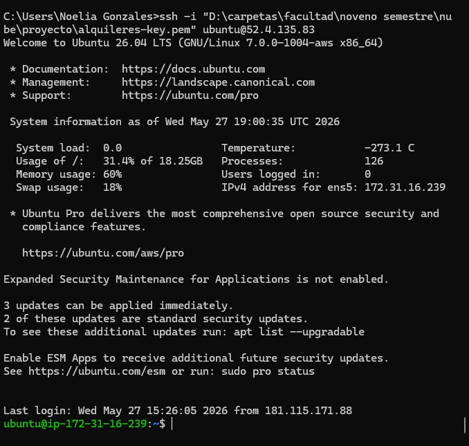


### Instalar docker en la instancia

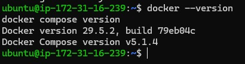

###  Conexión y configuración de RDS

```bash
# Instalar cliente PostgreSQL
sudo apt install postgresql-client -y

# Conectar al RDS
psql -h db-alquileres.cmdk6w2y4l62.us-east-1.rds.amazonaws.com -U alquileres_user -d postgres
```


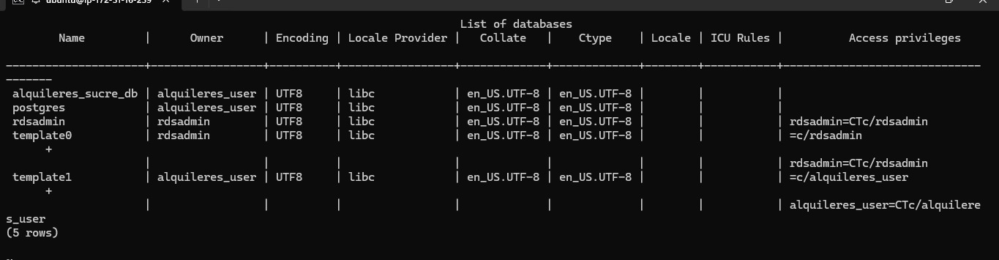


```bash
# Levantar todos los servicios en producción
docker compose up -d --build
```


### Ver estado de los contenedores
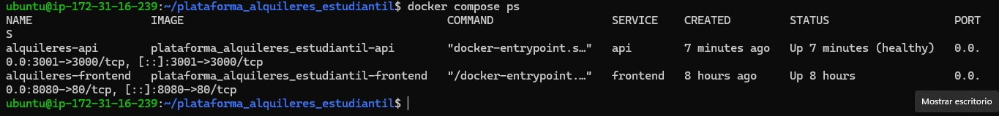


### Ver logs de la API
docker logs alquileres-api --tail 50 y 
docker logs -f alquileres-api

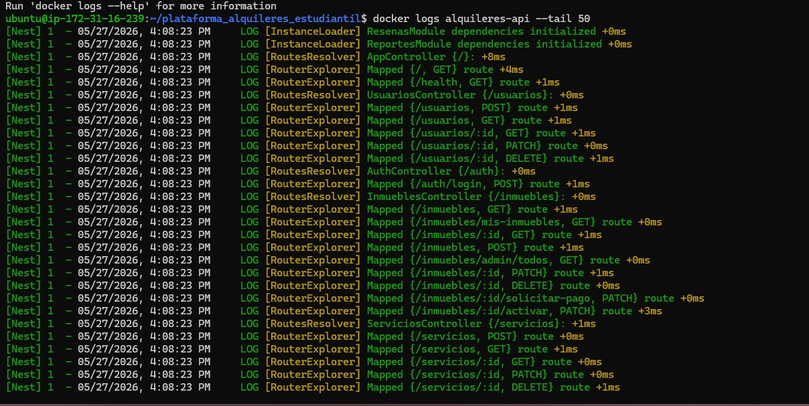


### Inspeccionar red interna
docker network ls

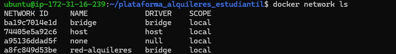

### Ver volúmenes
docker volume ls
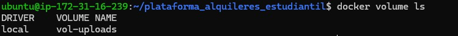


###  Health Check


#### Verificar que la API responde
curl http://localhost:3001/health

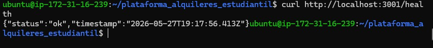


#### Desde el exterior
curl http://52.4.135.83:3001/health
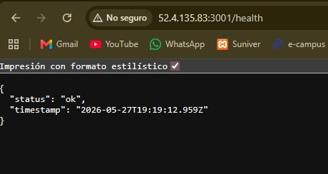


## 7. Pipeline CI/CD — GitHub Actions

#### Creacion del ci_cd.yml
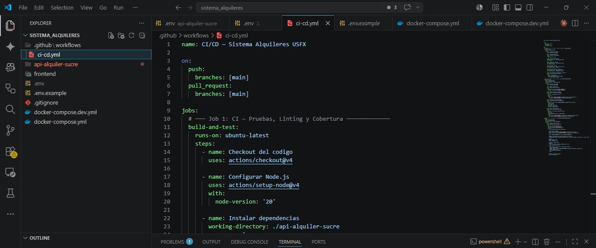
#### Imagenes del docker hub

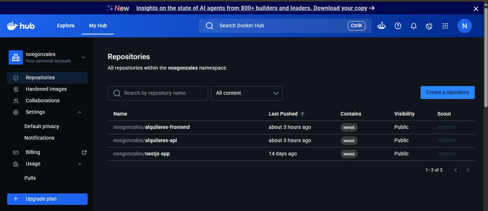

#### github action 

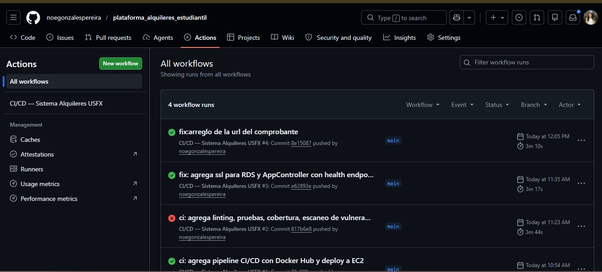


#### Configuramos los Secrets and variables en el repositorio del proyecto

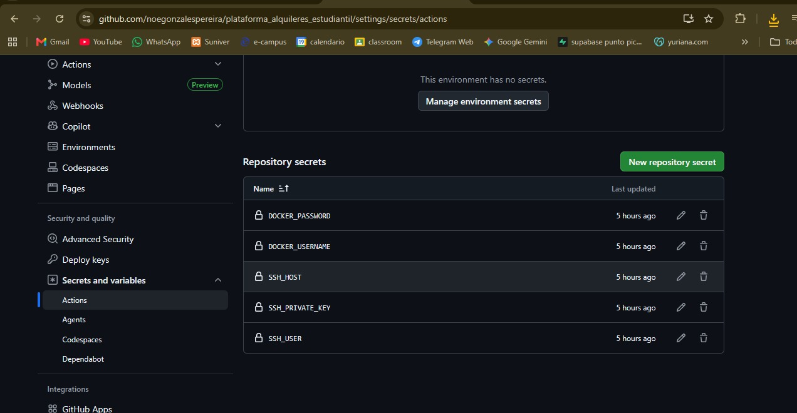

#### Verificamos que el github actions se aplico correctamente y se lanzo una nueva imagen y se actualizo en  la ec2

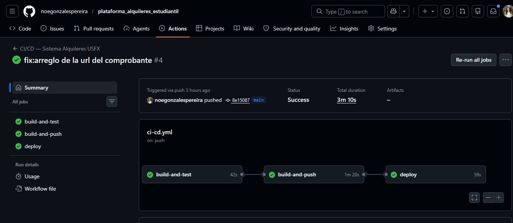


### 8.1 AWS Lambda — Redimensionamiento Automático de Imágenes

Cuando un propietario sube una fotografía de su inmueble, el archivo original se almacena en el bucket S3 `alquileres-imagenes-10380909`. Para optimizar el ancho de banda y la experiencia del usuario, se implementó una función Lambda que se dispara automáticamente ante cada carga de imagen y genera versiones redimensionadas listas para ser servidas desde CloudFront.

**Flujo de funcionamiento:**

1. El propietario sube una imagen desde la app → la API NestJS la guarda en S3 en la carpeta `originals/`.
2. El evento `s3:ObjectCreated` en la carpeta `originals/` dispara automáticamente la función `lambda-redimensionar-img`.
3. La función descarga la imagen original, genera tres versiones con la librería **Sharp** (thumbnail 150×150, medium 600px, large 1200px) y las guarda en S3 en las carpetas correspondientes (`thumbnails/`).
4. CloudFront sirve la versión adecuada según el contexto de la interfaz (listado, detalle, galería).

**Configuración de la función Lambda:**

| Parámetro | Valor |
|-----------|-------|
| Nombre | `lambda-redimensionar-img` |
| Runtime | Node.js 20.x |
| Memoria | 512 MB |
| Timeout | 30 segundos |
| Trigger | S3 — evento `s3:ObjectCreated` en prefijo `originals/` |
| Permisos IAM | `s3:GetObject` y `s3:PutObject` sobre el bucket `alquileres-imagenes-10380909` |

#### Creación de la función Lambda en la consola AWS


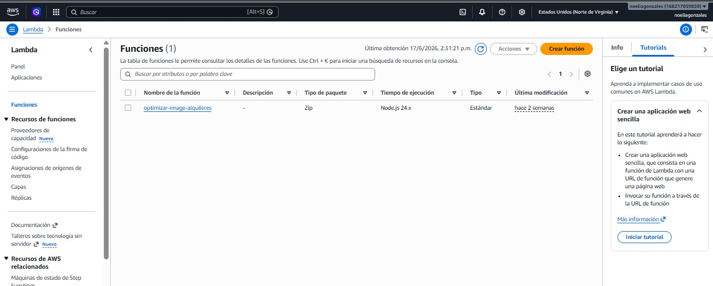

#### Configuración del trigger S3 en la función Lambda

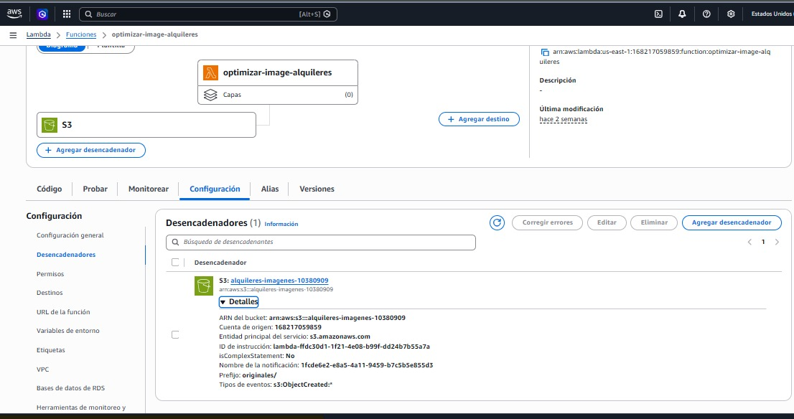

#### Código de la función Lambda desplegado


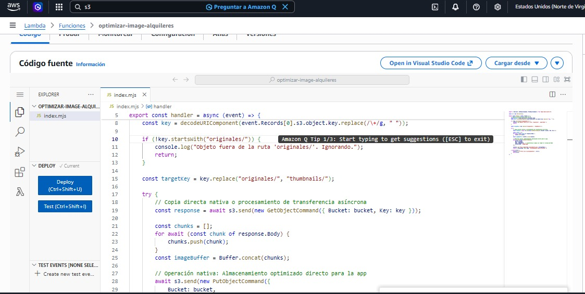

#### Resultado: imágenes redimensionadas en S3


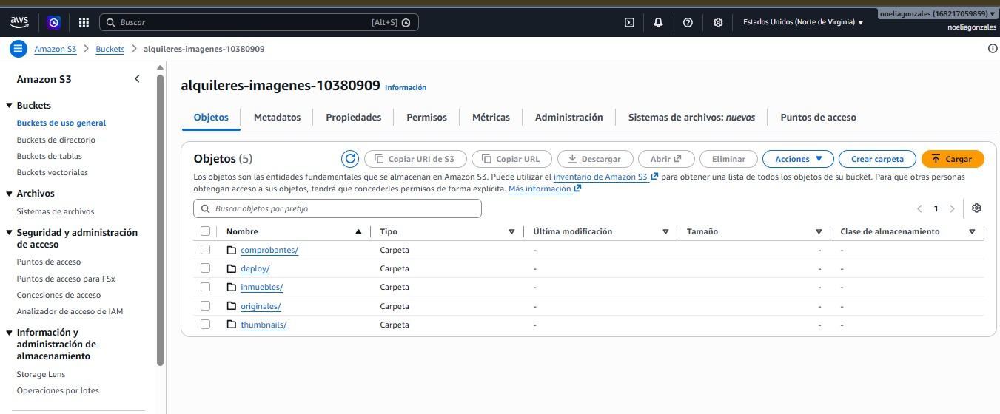

---

### 8.2 Amazon SES — Notificaciones por Correo Electrónico

Se integró **Amazon SES (Simple Email Service)** para enviar correos automáticos en dos escenarios clave del flujo de pagos y publicaciones:

**Escenario 1 — Notificación al Propietario (publicación aprobada):**
Cuando el administrador valida el comprobante de pago de un propietario y aprueba su publicación, el sistema envía automáticamente un correo al propietario informándole que su inmueble ya está visible para los estudiantes.

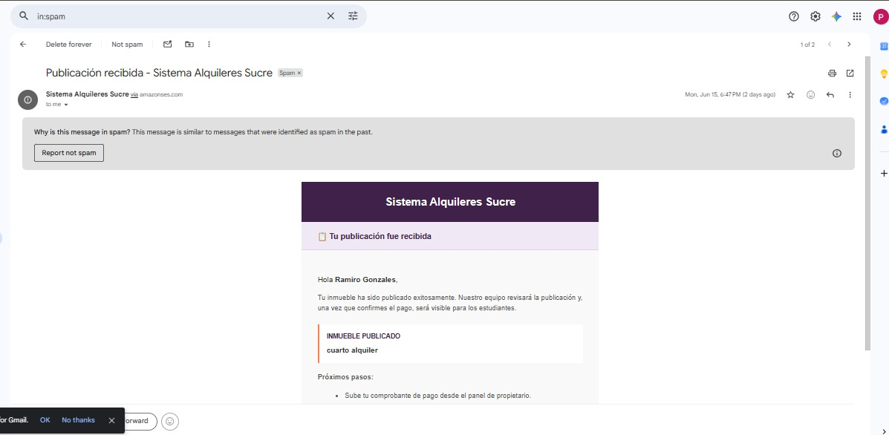
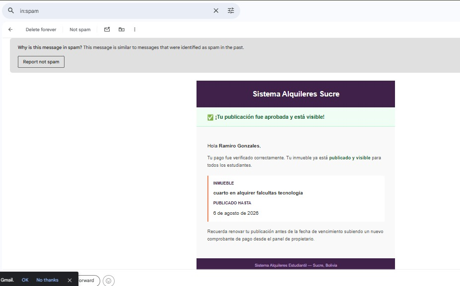


**Escenario 2 — Notificación al Administrador (nuevo pago recibido):**
Cuando un propietario sube un comprobante de pago, el sistema envía un correo al administrador avisándole que hay un nuevo pago pendiente de validación.

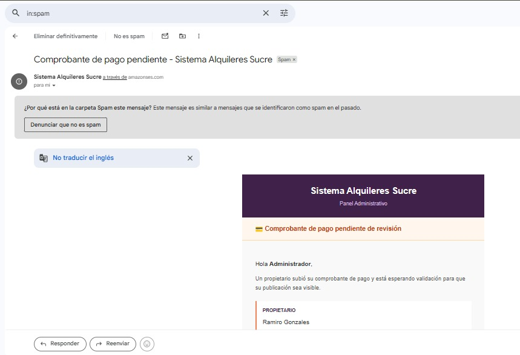


**Configuración de Amazon SES:**

| Parámetro | Valor |
|-----------|-------|
| Región | `us-east-1` |
| Identidad verificada (remitente) | `pieceofcake079@gmail.com` |
| Modo | Sandbox (correos solo a direcciones verificadas) |
| Integración | AWS SDK v3 — `@aws-sdk/client-ses` en NestJS |
| Credenciales | Usuario IAM `alquileres-s3-user` con política `AmazonSESFullAccess` |

#### Verificación de identidad de correo en SES

->
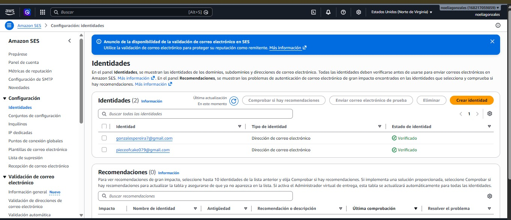


### App funcionando

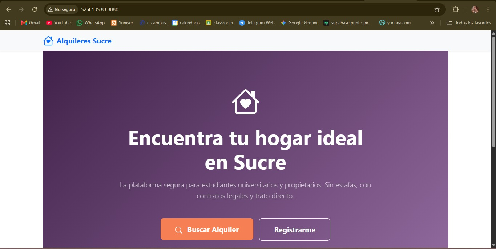


---
